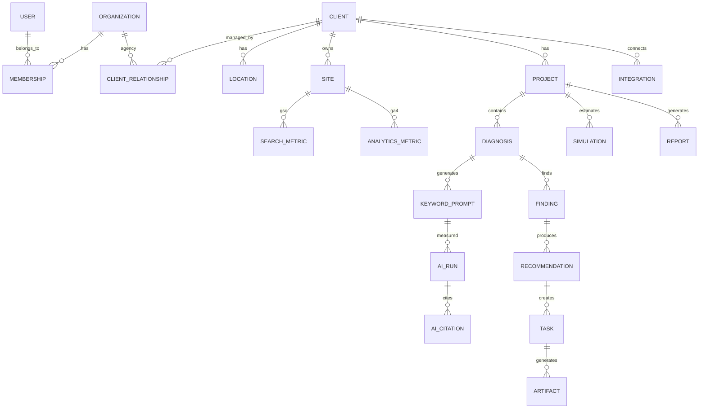

# AirReach P0 — ER（Client / Agency / Diagnosis）

Status: DRAFT FOR IMPLEMENTATION
Date: 2026-09-20
Extends: `docs/airreach-final-spec.md` Canonical ER

## 追加の中心概念

既存の organization / workspace / site に加え、代理店運用のため **Client** と **ClientRelationship** を明示する。

## 新規 / 拡張テーブル

### client
- id
- display_name
- industry_id
- primary_url
- region_text
- created_at

### client_relationship
- id
- agency_organization_id
- client_id
- role (owner | seller | consultant)
- status (active | paused | ended)
- created_at

### location
- id
- client_id
- name
- address_text
- geo (optional)

### project
- id
- client_id
- title
- status (diagnosed | proposed | won | active | closed)
- owner_user_id
- created_at

### diagnosis (scan)
- id (scan_id / public share id)
- project_id nullable
- client_id nullable
- site_url
- industry_id
- outcome_goal (reservation | visit | phone | line | inquiry | meeting | download | awareness)
- auto_keyword
- score_overall
- evidence_summary_json
- created_at
- created_by_user_id nullable
- source (airreach_free | sales_mode | expert)

### finding / recommendation / task / artifact / simulation / report / integration
- 既存 final-spec の意図を踏襲。数値フィールドは evidence_class 必須。

## P0 ブラウザ橋渡し（サーバー前）

`localStorage` キー:

| Key | 内容 |
|---|---|
| `airreach_scan_v1:{scanId}` | 1診断のスナップショット |
| `airreach_scan_index_v1` | 直近 scanId 一覧 |
| `airreach_onboard_survey_v1` | 互換（既存） |

サーバー投入時は diagnosis 行へそのままマップする。
