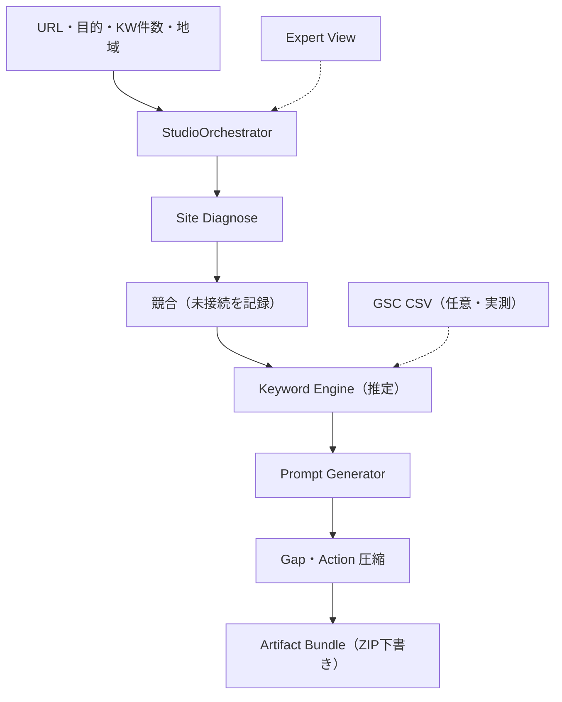

# AirReach Studio Orchestrator Phase 1 仕様

## 1. 結論

Phase 1 の AirReach Studio は、URL・目的・キーワード件数・地域を一度入力すると、既存の診断・推定・生成処理をブラウザ内で順に実行し、判断結果と実装用の下書きを一つの ZIP にまとめる実行 OS とする。

表側は Overview 一画面だけにし、既存の不足分析、競合、生成、キーワード、時系列、Google、HackⅡの各画面は削除せず `Expert View` の中へ退避する。バックエンド、外部キーワード DB、HackⅡ API、GitHub、本番環境への接続は Phase 1 の必須条件にしない。

本書を Studio Phase 1 の正本とする。旧構成は [`airreach-studio-architecture.md`](airreach-studio-architecture.md) を参照できるが、矛盾する場合は本書を優先する。

## 2. Phase 1 の利用フロー

1. 利用者が対象 URL、目標、キーワード件数（20・50・100）、地域を入力する。
2. `StudioOrchestrator` が既存の Site Diagnose、キーワード推定、Prompt 生成、Gap／Action 生成を順に呼ぶ。
3. 同じ画面内で「サイト確認 → 競合 → 需要 → KW選定 → AI質問 → 施策 → ファイル準備」の進捗を表示する。
4. 完了後に4数字、結論1文、キーワード戦略表、実装箇所の圧縮結果を表示する。
5. 利用者が ZIP を生成し、人間が内容を確認してから実装へ渡す。

競合ステップは、Phase 1 では比較分析を実行しない。競合 SERP・AI Citation のライブ測定が未接続であることを `warning` として記録し、キーワード候補の `competitor_gap` は「未計測」とする。Expert View の競合メモは利用者が確認した事実の手動記録であり、Overviewの自動分析結果へは混ぜない。

## 3. ブラウザ内アーキテクチャ



- 実行主体は `assets/js/airreach-orchestrator.js` とする。
- 既存機能は `assets/js/airreach-studio.js` から公開 API として呼び、同じ処理を複製しない。
- 実行中に別ページへ遷移しない。
- 入力、進捗、結果は一つの `analysis_job` に束ねる。
- Overviewからのサイト確認はブラウザの直接取得だけを試し、取得代行プロキシへ対象URLを送らない。CORS等で取得できない場合は `warning` として続行する。
- Phase 1 の成果物は下書きであり、公開サイト、GitHub、本番環境を更新しない。

## 4. `analysis_job` 状態機械

### 4.1 ジョブ状態

| 状態 | 意味 | 次の状態 |
|---|---|---|
| `idle` | 入力前または初期状態 | `running`, `failed` |
| `running` | 入力検証後、一つ以上のステップを実行中 | `completed`, `failed` |
| `completed` | 必須ステップと ZIP 用データが完成 | 終端。再実行時は新規ジョブ |
| `failed` | 入力不備または回復不能エラー | 終端。入力修正・再実行時は新規ジョブ |
| `interrupted` | `running` の保存状態をページ再読込時に検出 | 終端。再実行時は新規ジョブ |

`completed` は本番反映、GitHub PR 作成、外部 API 接続、成果発生を意味しない。ブラウザ内の分析と ZIP 下書きが完成した状態だけを表す。診断や任意接続が取得できない場合は、該当ステップを `warning` とし、未取得値を `null` のまま推定処理を続行できる。

### 4.2 ステップ状態

各ステップは `pending | running | completed | warning | failed` を持つ。ページ再読込時に実行中だったステップだけは、保存状態の復元時に `interrupted` へ変わる。

| 順序 | `step_id` | Overview 表示 | Phase 1 の処理 |
|---:|---|---|---|
| 1 | `site` | サイト確認 | 入力した1ページと同一サイトの `llms.txt`・`robots.txt`を既存診断で確認 |
| 2 | `competitors` | 競合 | ライブ取得は行わず、未接続を `warning` として記録 |
| 3 | `demand` | 需要 | GSC接続状態を確認。市場検索需要の推定とは分離 |
| 4 | `keywords` | KW選定 | 指定件数まで候補を優先度付けし、推定需要を生成 |
| 5 | `prompts` | AI質問 | KWごとの質問候補を生成 |
| 6 | `actions` | 施策 | 提案をページ・実装箇所単位へ圧縮 |
| 7 | `artifacts` | ファイル準備 | 必須ファイルと manifest を組み立てる |

任意の GSC CSV が未指定、未接続、または該当 KW なしの場合も、`gsc_status` を記録したうえで推定値だけで続行できる。必須ステップが失敗した状態で `completed` にしてはならない。

### 4.3 最小ジョブモデル

```json
{
  "type": "analysis_job",
  "id": "analysis_job_...",
  "schema_version": "1.0",
  "status": "idle",
  "run_token": 0,
  "input": {},
  "steps": [],
  "current_step": null,
  "progress": 0,
  "diagnosis": null,
  "gsc_status": {},
  "keyword_candidates": [],
  "prompt_candidates": [],
  "actions": [],
  "artifact_bundle": null,
  "summary": {},
  "conclusion": "",
  "warnings": [],
  "error": null,
  "created_at": null,
  "started_at": null,
  "completed_at": null,
  "updated_at": null
}
```

日時は ISO 8601、件数は整数、未取得値は `0` ではなく `null` とする。ジョブ開始時の入力をスナップショット化し、実行途中のフォーム変更で結果の前提が変わらないようにする。

## 5. 入力モデル

```json
{
  "url": "https://example.com/",
  "goal": "問い合わせ",
  "keywordCount": 20,
  "region": "東京都"
}
```

| フィールド | 必須 | 制約 |
|---|---:|---|
| `url` | 必須 | `http` または `https` で、hostnameを含むURL |
| `goal` | 必須 | UIの許可値から選択。空欄不可 |
| `keywordCount` | 必須 | `20 | 50 | 100` |
| `region` | 必須 | 国・都道府県・市区町村等の表示用文字列 |

GSC CSV は Overview の `analysis_job.input` には含めない。Expert View で事前に手動取込された端末内データを `getGscStatus()` とキーワード完全一致用の索引から参照する。未取込の場合は `GSC未接続` のまま続行する。

URLから料金、症例、顧客名、実績、所在地等を推測して補完してはならない。取得できない情報は「未取得」または確認タスクとして残す。

## 6. 出力モデルと来歴

### 6.1 `keyword_candidate[]`

```json
{
  "keyword_id": "kw_001",
  "keyword": "AIO 対策 会社",
  "intent": "Commercial",
  "priority": "P0",
  "estimated_monthly_demand": 880,
  "volume_source": "Estimated",
  "estimate_method_version": "airreach-sales-v1",
  "gsc_impressions": 142,
  "gsc_period_start": "2026-08-01",
  "gsc_period_end": "2026-08-31",
  "gsc_source": "Official",
  "gsc_status": "matched",
  "ai_prompt_count": 3,
  "competitor_gap": "未計測",
  "competitor_gap_source": null,
  "action": "比較軸の下書きを作成"
}
```

`volume_source` は市場検索需要の出典だけを示す。Phase 1 の内部推定は `Estimated` とする。将来、正式に接続した Keyword Planner 等の市場ボリュームを使う場合だけ `Official` を利用できる。

GSC の `impressions` は対象サイトが実際に表示された回数であり、市場全体の検索需要ではない。次のルールを固定する。

- UIは `月間検索需要（推定）` と `GSC Impressions（実測）` を別カラム・別バッジで表示する。
- GSC 未接続時は `gsc_impressions: null`、`gsc_status: "not_connected"` とし、「GSC未接続」と表示する。
- GSC に該当 KW がない場合は `gsc_status: "not_matched"` とし、実測 `0` と区別する。
- 取込プロパティが分析対象 URL と一致しない、または対象プロパティを確認できない場合は `property_mismatch` / `unbound` とし、Official値を候補・Platform・Handoffへ渡さない。
- Expert ViewのGA4行を共通baselineへ渡す場合も、全Official行のURLが同じ対象プロパティに結合できることを必須とする。相対Landing pageは確認済みGSCプロパティを基準に解決し、未結合・混在行は共有しない。
- 推定需要と GSC Impressions を加算、平均、置換しない。
- 「検索回数」という曖昧な一語にまとめない。

### 6.2 `prompt_candidate[]`

最低限、`prompt_id`, `keyword_id`, `prompt`, `intent`, `locale`, `generation_basis`, `status` を持つ。質問は調査候補であり、HackⅡで測定済み、AIで引用済み、または需要が実証済みとは扱わない。

### 6.3 `actions[]` とページ単位の圧縮

Phase 1 の `buildActions()` は、細かなKW別提案をそのまま並べず、`existing | new | faq | schema | link` の5種類へ圧縮した下書きを作る。同じ `type × 正規化したtarget_url` は一件にし、`target_key` を安定した重複排除キーとして保持する。`source_refs` は先頭5件までのKW IDであり、Prompt IDやライブ競合測定の根拠ではない。

```json
{
  "id": "act_001",
  "type": "faq",
  "target_key": "faq|https://example.com/service/#faq",
  "title": "購入前質問の可視FAQ下書きを作成",
  "target_url": "https://example.com/service/#faq",
  "reason": "生成したAI質問候補に対し、公式回答の確認枠を用意する",
  "evidence_class": "Inferred",
  "source_refs": ["kw_001"],
  "status": "draft"
}
```

Overview の「既存○／新規○／FAQ○／Schema○／リンク○」は、圧縮後の各 `type` の件数である。「直すのは N 箇所」の `N` は、`blocked_reason` のない重複排除後のAction件数とし、KW数やPrompt数を流用しない。サイト確認に失敗した場合のActionは保留としてZIPへ残せるが、「実装可能件数」には数えない。Schema Actionは「可視本文と一致するSchemaの要否を確認する」下書きであり、Phase 1は未確認のJSON-LDを生成しない。

### 6.4 `artifact_bundle`

```json
{
  "file_name": "airreach-studio-analysis_job_....zip",
  "files": {
    "README.md": "...",
    "MANIFEST.json": "..."
  },
  "manifest": {
    "bundle_id": "bundle_analysis_job_...",
    "job_id": "analysis_job_...",
    "status": "draft",
    "generated_at": "2026-09-19T00:00:00Z"
  }
}
```

`artifact_bundle` はZIPへ入れるファイル本文とmanifestのブラウザ内モデルである。ジョブ完了時点では外部保存せず、利用者が「ZIPを生成」を押したときに単一のZIP Blobとしてダウンロードする。ZIPは実装用の下書きであり、生成と公開を同義にしない。

## 7. ZIP 必須構造

```text
airreach-studio-{job_id}.zip
├── README.md
├── MANIFEST.json
├── AGENT_PROMPT.md
├── strategy/
│   ├── keyword-candidates.csv
│   ├── prompt-candidates.csv
│   └── actions.csv
├── schema/
│   └── VALIDATION_REQUIRED.md
├── content-drafts/
│   └── IMPLEMENTATION_DRAFT.md
├── content-stubs/
│   └── CONTENT_DRAFT.md
├── public/
│   ├── llms.txt
│   └── llms-full.txt
└── validation/
    └── VALIDATION.md
```

- `README.md`: 入力、生成日時、推定・実測の区分、導入順、対象外を記載する。
- `MANIFEST.json`: 全ファイルの相対パス、役割、下書き状態を列挙する。
- `AGENT_PROMPT.md`: 「事実を創作しない」「Schemaは可視本文と一致」「顧客名・料金・症例・実績を推測しない」「人間承認前に公開・Deployしない」「掲載・順位・流入・問い合わせ・売上を保証しない」を固定指示に含める。
- `strategy/*.csv`: 推定需要、GSC実測、状態、根拠IDを別列で保持する。
- `schema/VALIDATION_REQUIRED.md`: Phase 1では未確認のJSON-LDを生成せず、可視本文との照合・構文検証・人間承認を要求する。
- `content-drafts/IMPLEMENTATION_DRAFT.md`: 優先トピック、提案変更、確認事項をまとめた主たる実装下書き。
- `content-stubs/CONTENT_DRAFT.md`: 同じ下書きを後方互換用のcontent stub名でも同梱する。
- `public/llms*.txt`: 補助ファイルであり、検索順位やAI引用を保証しない旨を含める。
- `validation/VALIDATION.md`: 人間が確認すべき事実、Schema一致、リンク、文字化け、実装・公開前承認をチェックリスト化する。

`buildArtifactBundle()` は上記の固定ファイルを組み立て、`MANIFEST.json` 自身を含む全パスをmanifestへ列挙する。`createZipBlob()` は空バンドル、不正・絶対・重複パス、サイズ超過をエラーにし、ブラウザ内で無圧縮ZIPを作る。サーバー保存を前提にしない。

## 8. エラー、再実行、重複防止

回復不能エラーは `analysis_job.error` に `step`, `code`, `message` を保存する。続行可能なエラーは `warnings[]` に `step`, `code`, `message`, `at` を保存し、該当ステップを `warning` にする。画面には短い原因を表示し、スタックトレースや内部情報を表示しない。

| 事象 | 扱い |
|---|---|
| URL形式、目標、件数、地域の不備 | 新しい `failed` ジョブを作り、`error.code = INVALID_INPUT` |
| サイト取得・解析の失敗 | `site` を `warning`、`diagnosis = null` として続行 |
| 競合ステップ | 未接続を `COMPETITOR_LIVE_UNCONNECTED` の `warning` として続行 |
| GSC状態取得失敗・未接続 | `demand` を `warning` または未接続状態とし、推定値で続行 |
| GSC CSV解析失敗 | Expert Viewの取込エラー。実行中のジョブ入力や推定需要へ混ぜない |
| KW・Prompt・Action・bundle生成失敗 | ジョブを `failed` にし、ZIPボタンを有効化しない |
| ZIP Blob生成・ダウンロード失敗 | 完了済み分析結果を保持して画面にエラー表示し、利用者が再度生成できる |
| 新しい実行またはreset | `run_token` を更新し、旧実行から遅れて返った結果を破棄。`cancelled` 状態は作らない |
| `running` 中のページ再読込 | 保存済みジョブと実行中ステップを `interrupted` にし、再実行を促す |

`retry()` は最後に検証を通った入力を使い、新しい `id` と `run_token` のジョブを作って `site` から全7ステップを再実行する。途中ステップからのresumeではない。各配列は新規ジョブへ置換されるため、KW、Prompt、Action、ファイルを重複追加しない。フォームから再送した場合も新規ジョブとする。`reset()` は進行中結果を無効化し、`idle` ジョブへ戻す。

## 9. Phase 2 以降の境界

次は `planned` かつ Phase 1 では未接続である。UIへ置く場合は「未接続」または「準備中」を常時表示し、成功通知を出さない。

- Google Ads Keyword Planner または外部キーワード DB の接続
- 競合 SERP・AI Citation の自動取得と HackⅡ API によるライブ測定
- GitHub OAuth、branch 作成、commit、Pull Request 自動作成、Preview
- Jev Decision Engine の本接続
- 人間承認後の本番 Deploy
- Intervention、Prediction vs Actual、Industry uplift の永続 DB

これらのボタンは Phase 1 の `analysis_job` の成功条件に含めない。

## 10. 非保証・公開ルール

- 市場検索需要はモデルによる推定であり、広告管理画面等の公式検索ボリュームではない。
- GSC実測は対象プロパティ・期間・クエリ条件に依存し、市場全体を示さない。
- 競合差はPhase 1では「未計測」。AI質問、施策、コンテンツ、Schema確認、llms系ファイルは候補または下書きである。
- 検索順位、AIでの掲載・言及・引用、流入、問い合わせ、予約、売上を保証しない。
- 生成物を本番へ自動反映しない。公開前に人間が事実、権利、表示内容、技術要件を確認する。
- Studioは当面 `noindex` を維持し、公開事実は `_data/public_facts.yml` と一致させる。

## 11. Phase 1 受入条件

- [ ] Overview 最上部に URL、目的、KW件数、地域、主CTA「サイト全体を分析する」だけがある。
- [ ] 左ナビ相当の既存機能は削除されず、`Expert View` 内だけにある。
- [ ] 実行中は7ステップの現在状態と失敗状態が同じ画面に表示される。
- [ ] 完了後に4数字、非保証の結論1文、KW戦略表、実装圧縮、ZIP生成が表示される。
- [ ] 推定需要と GSC Impressions が別フィールド・別カラム・別バッジである。
- [ ] GSC未接続を `0` とせず、「GSC未接続」と表示する。
- [ ] Action件数が圧縮後の実装箇所から計算され、KW数を流用していない。
- [ ] ZIPに必須ファイルが入り、`MANIFEST.json` の一覧と一致する。
- [ ] `AGENT_PROMPT.md` に創作禁止、Schemaと可視本文の一致、人間承認、非保証が固定されている。
- [ ] GitHub PR、本番Deploy、Keyword Planner、HackⅡライブ測定は「未接続／準備中」で、完了表示にならない。
- [ ] 入力不備、途中失敗、ZIP失敗を再現でき、再実行は新規ジョブとして全工程を走り直し、データが重複しない。
- [ ] `python3 scripts/content_guard.py` が成功する。
- [ ] Studioページに `noindex` が残っている。
