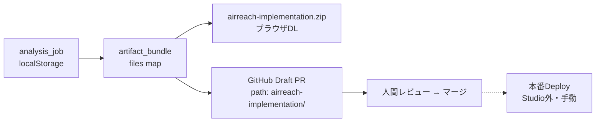
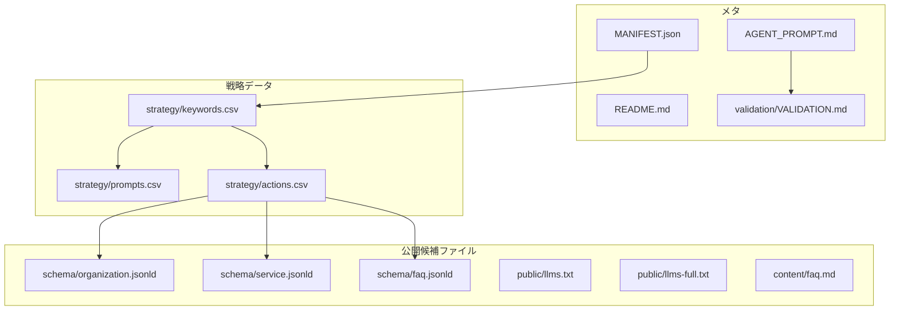
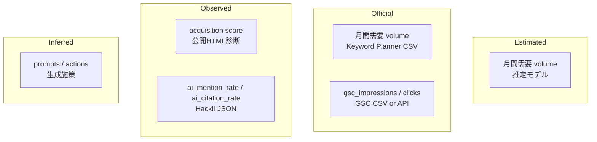
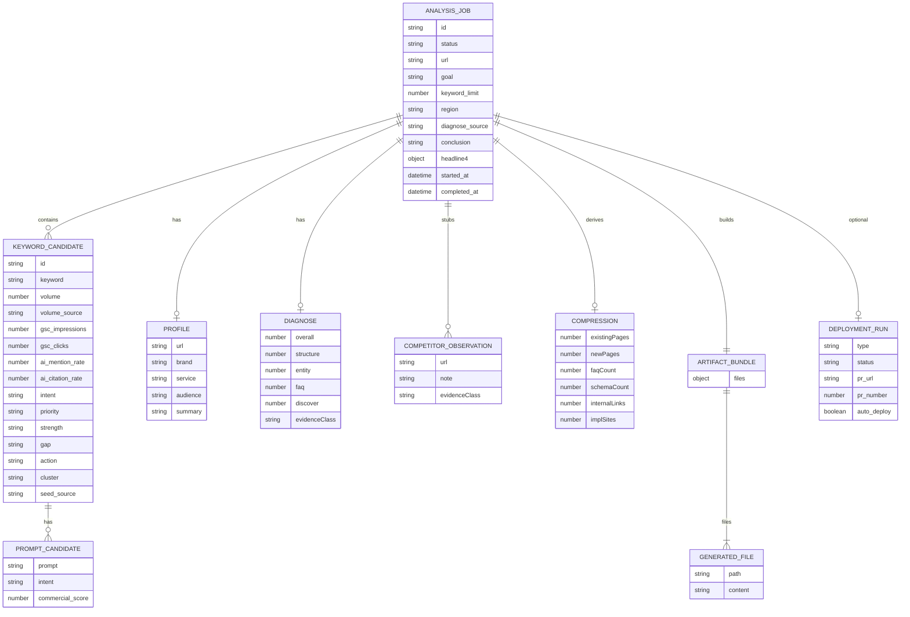
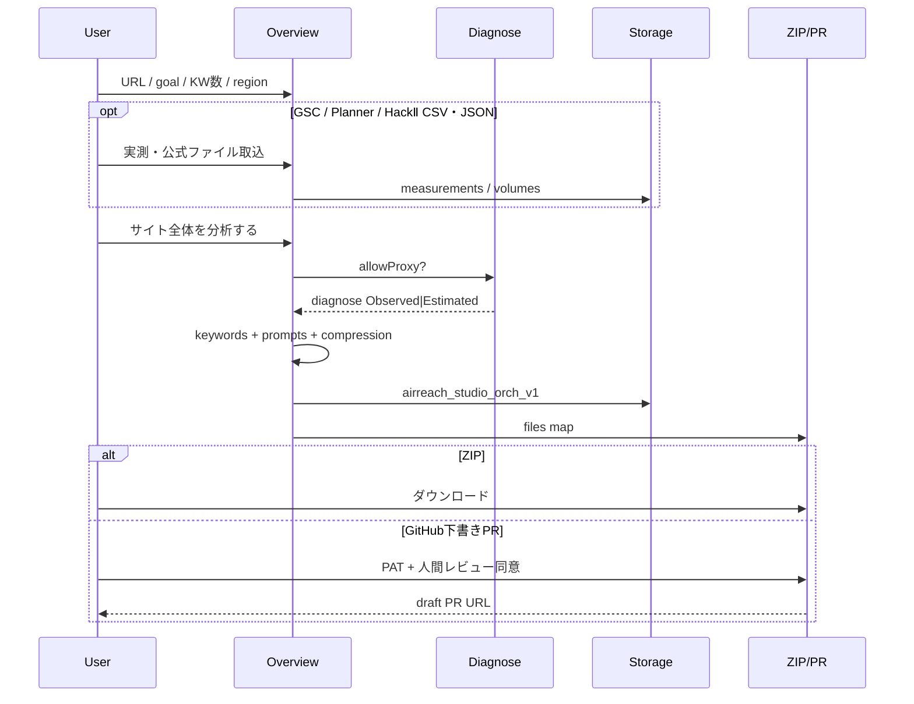

# HackⅡ Studio — 実装パッケージ＆データ構造 設計図

この文書は、Overview が生成する **ZIP（ダウンロード）** と **GitHub 下書きPR** が共有するディレクトリ構造と、ブラウザ内データモデルの設計図です。

- 実装: `assets/js/airreach-orchestrator.js`, `assets/js/airreach-orch-phase2.js`, `assets/js/airreach-package-schema.js`
- 検証: `node scripts/validate_studio_package.js --smoke`
- 画面: `/airreach/studio/`
- 公開方針: 下書きのみ。自動マージ・本番自動Deployなし

---

## 1. 成果物の二つの出口



| 出口 | ルート構造 | 備考 |
|------|------------|------|
| ZIPダウンロード | ZIP直下に下記ツリー | ファイル名 `airreach-implementation.zip` |
| GitHub下書きPR | `{path}/` 既定 `airreach-implementation/` | PATは `sessionStorage` のみ。`draft: true` |

ZIPとPRの **中身の相対パスは同一** です。

---

## 2. ZIP / PR ディレクトリ構造

```text
airreach-implementation/
├── README.md                 # パッケージ概要（下書きである旨）
├── MANIFEST.json             # 生成メタ・証拠クラス・圧縮結果
├── AGENT_PROMPT.md           # 実装エージェント向け制約プロンプト
├── strategy/
│   ├── keywords.csv          # 対策キーワード台帳
│   ├── prompts.csv           # AI向け質問候補
│   └── actions.csv           # 実装圧縮サマリ（ページ/FAQ/Schema等）
├── schema/
│   ├── organization.jsonld   # Organization 下書き
│   ├── service.jsonld        # Service 下書き
│   └── faq.jsonld            # FAQPage 下書き
├── public/
│   ├── llms.txt              # 機械可読インデックス（要約）
│   └── llms-full.txt         # FAQ付き拡張版
├── content/
│   └── faq.md                # 人間向けFAQ下書き
└── validation/
    └── VALIDATION.md         # 公開前チェックリスト
```

### 2.1 役割マップ



---

## 3. 証拠クラス（混ぜないルール）



| フィールド | 許可ソース | 混ぜてはいけないもの |
|------------|------------|----------------------|
| `volume` + `volume_source=Estimated` | 推定モデル | GSC Impressions |
| `volume` + `volume_source=Official` | Keyword Planner CSV | 「GSC検索回数」ラベル |
| `gsc_impressions` | GSC CSV / `/api/google/gsc` | 市場需要の単一ラベル |
| `overall` 獲得力 | 公開HTML診断 Observed / 失敗時 Estimated | AI言及・引用率 |
| `ai_mention_rate` / `ai_citation_rate` | HackⅡ JSON | 準備度スコア |
| prompts / actions | Inferred | 順位・引用・売上の保証 |

---

## 4. ブラウザ内データモデル（設計図）

永続化キー:

| キー | 場所 | 内容 |
|------|------|------|
| `airreach_studio_orch_v1` | localStorage | `{ lastJob: analysis_job }` |
| `airreach_studio_v1` | localStorage | Expert用 profile / keywords / measurements / hack2 |
| `airreach_studio_gh_v1` | sessionStorage | repo / base / path / PAT（永続しない） |
| `airreach_studio_last_pr_v1` | sessionStorage | 直近PR URL・番号 |



### 4.1 `analysis_job`（ランタイム）

```json
{
  "id": "string",
  "status": "running | completed",
  "url": "https://example.com/",
  "goal": "問い合わせを増やす",
  "keyword_limit": 100,
  "region": "全国",
  "profile": { "url": "", "brand": "", "service": "", "audience": "", "summary": "" },
  "diagnose": { "overall": 0, "structure": 0, "entity": 0, "faq": 0, "discover": 0, "gaps": [] },
  "diagnose_source": "Observed | Estimated",
  "competitors": [{ "url": "", "note": "", "evidenceClass": "Estimated" }],
  "keywords": ["KEYWORD_CANDIDATE..."],
  "totalDemand": 0,
  "compression": {},
  "conclusion": "",
  "headline4": { "keywords": 0, "demand": 0, "score": 0, "implSites": 0 },
  "files": { "README.md": "...", "MANIFEST.json": "..." },
  "hack2_imported": 0,
  "deployment_run": {
    "type": "github_draft_pr",
    "status": "awaiting_human_review",
    "pr_url": "https://github.com/org/repo/pull/1",
    "pr_number": 1,
    "auto_deploy": false
  },
  "started_at": "ISO-8601",
  "completed_at": "ISO-8601",
  "steps": [{ "id": "site", "label": "...", "status": "pending|running|done", "pct": 0 }]
}
```

### 4.2 `keyword_candidate`

| フィールド | 型 | 説明 |
|------------|-----|------|
| `keyword` | string | 表示・対策対象語 |
| `volume` | number | 月間需要（Estimated or Official） |
| `volume_source` | `Estimated` \| `Official` | Planner取込時のみ Official |
| `gsc_impressions` | number\|null | GSC実測。需要と別列 |
| `gsc_clicks` | number\|null | GSC実測 |
| `gsc_position` | number\|null | 加重平均順位 |
| `ai_mention_rate` | number\|null | HackⅡ言及率 % |
| `ai_citation_rate` | number\|null | HackⅡ引用率 % |
| `priority` | `P0`\|`P1`\|`P2` | 並びの第一キー |
| `seed_source` | `Generated`\|`GSC`\|`KeywordPlanner` | 種の由来 |
| `prompts[]` | prompt_candidate | AI質問 |

### 4.3 `deployment_run`（Phase 2）

```json
{
  "type": "github_draft_pr",
  "status": "awaiting_human_review",
  "pr_url": "https://github.com/{owner}/{repo}/pull/{n}",
  "pr_number": 1,
  "auto_deploy": false
}
```

`auto_deploy` は常に `false`。StudioはマージもPages Deployも実行しない。

---

## 5. MANIFEST.json スキーマ

```json
{
  "generated_at": "ISO-8601",
  "url": "https://example.com/",
  "goal": "string",
  "brand": "string",
  "service": "string",
  "keyword_count": 0,
  "evidence": {
    "market_demand": "Estimated | Official (partial) + Estimated",
    "acquisition_score": "Observed | Estimated",
    "gsc": "Official (partial) | Unavailable",
    "hack2": "Observed (imported JSON) | Unavailable",
    "deployment": "ZIP only | Draft PR awaiting human review"
  },
  "conclusion": "string",
  "compression": {
    "existingPages": 0,
    "newPages": 0,
    "faqCount": 0,
    "schemaCount": 0,
    "internalLinks": 0,
    "implSites": 0,
    "topThemes": ["string"],
    "clusters": 0
  }
}
```

---

## 6. CSV列定義

### `strategy/keywords.csv`

```text
priority,keyword,volume,volume_source,gsc_impressions,gsc_clicks,ai_mention_rate,ai_citation_rate,intent,cluster,gap,action,seed_source
```

### `strategy/prompts.csv`

```text
keyword,prompt,intent,commercial_score
```

### `strategy/actions.csv`

```text
type,count,note
existing_page|new_page|faq|schema|internal_link,...
```

---

## 7. パイプライン（ジョブ状態機械）



ステップID: `site` → `competitors` → `demand` → `keywords` → `prompts` → `actions` → `files`

---

## 8. GitHub側への配置

下書きPR作成時、各ファイルは次のパスでコミットされます。

```text
{orch-gh-path}/README.md
{orch-gh-path}/MANIFEST.json
{orch-gh-path}/AGENT_PROMPT.md
{orch-gh-path}/strategy/keywords.csv
...（ZIPと同一相対構造）
```

既定 `{orch-gh-path}` = `airreach-implementation`

PR本文には人間向けチェックリストと「自動マージ・本番Deployなし」を明記します。

---

## 9. 関連コード

| ファイル | 役割 |
|----------|------|
| `assets/js/airreach-package-schema.js` | 必須パス・CSV列・バリデーション（設計図の実行契約） |
| `assets/js/airreach-orchestrator.js` | ジョブ・ZIP生成・表描画 |
| `assets/js/airreach-orch-phase2.js` | Planner / HackⅡ / Draft PR / 公開前チェック |
| `scripts/validate_studio_package.js` | パッケージ構造のCLI検証 |
| `assets/js/airreach-studio.js` | Expert View・measurements |
| `docs/airreach-studio-orchestrator.md` | プロダクト仕様（本設計図の上位） |
| `_data/public_facts.yml` → `hack2_studio` | 公開可能な定義・制限 |

---

## 10. 変更時の注意

1. ZIPツリーを変えるときは **本設計図・AGENT_PROMPT・MANIFEST** を同時更新する
2. `volume` と `gsc_impressions` を同一列・同一ラベルにしない
3. GitHub PATを `localStorage` やリポジトリに保存しない
4. `deployment_run.auto_deploy` を `true` にする機能は追加しない
